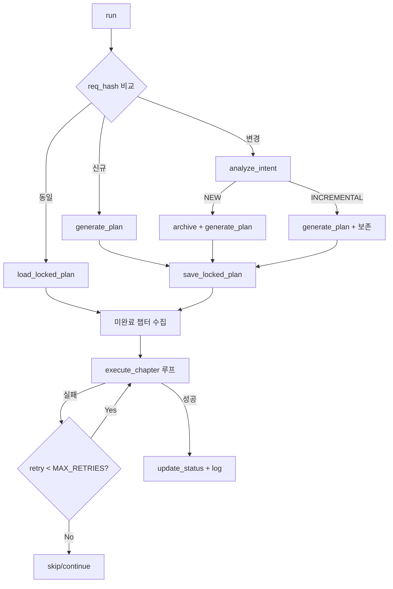

# 🔍 harness.py (SmartOrchestrator v4) 분석 보고서

## 1. 현재 아키텍처 요약



### 잘 설계된 점 ✅
| 항목 | 설명 |
|------|------|
| POEC 패턴 | Plan Once → Lock → Execute로 비결정성 최소화 |
| 복합 해시 추적 | REQUIREMENTS.md + SKILLS.md 동시 변경 감지 |
| 실패 원인 주입 | 재시도 시 이전 실패 컨텍스트를 프롬프트에 포함 |
| 선택적 매니페스트 | 챕터 관련 파일만 상세 주입, 나머지는 경로만 |
| 아카이브 안전성 | 플랜 생성 성공 후에만 아카이브 실행 |
| 의도 캐싱 | 동일 해시면 LLM 호출 생략 |

---

## 2. 개선이 필요한 영역 (7가지)

### 🔴 P0: 에러 핸들링 부재

현재 `subprocess.run` / `subprocess.Popen` 호출에 예외 처리가 전혀 없습니다.

**문제 시나리오:**
- `claude` CLI가 PATH에 없을 때 → `FileNotFoundError` 크래시
- 네트워크 타임아웃 시 프로세스가 무한 대기 (timeout 미설정)
- JSON 파일 읽기 중 디스크 에러 → 미처리 예외

**개선안:**
```python
# 현재 (200-203행)
result = subprocess.run(
    ["claude", "-p", prompt],
    capture_output=True, text=True, cwd=self.base_dir,
)

# 개선
try:
    result = subprocess.run(
        ["claude", "-p", prompt],
        capture_output=True, text=True, cwd=self.base_dir,
        timeout=300,  # 5분 타임아웃
    )
except FileNotFoundError:
    print("❌ 'claude' CLI를 찾을 수 없습니다. PATH를 확인하세요.")
    return None
except subprocess.TimeoutExpired:
    print("❌ AI 응답 타임아웃 (300초). 네트워크를 확인하세요.")
    return None
```

`execute_chapter`의 `Popen`도 동일하게 timeout guard가 필요합니다.

---

### 🔴 P0: 빌드 검증 챕터의 구조적 문제

빌드 검증이 일반 챕터와 동일한 `execute_chapter`로 실행됩니다. 빌드 성공/실패를 **하네스가 직접 판단하지 못하고** LLM 출력의 `CHAPTER COMPLETE` 문자열에만 의존합니다.

**개선안:**
```python
def execute_build_verification(self):
    """빌드 검증을 하네스가 직접 수행"""
    build_dir = os.path.join(self.workspace_dir, "jira-calculator-plugin")
    if not os.path.exists(build_dir):
        return False, "빌드 디렉터리 없음"

    result = subprocess.run(
        ["atlas-mvn", "clean", "package", "-q"],
        cwd=build_dir, capture_output=True, text=True, timeout=600,
    )
    if result.returncode == 0 and "BUILD SUCCESS" in result.stdout:
        return True, result.stdout
    return False, result.stderr[-2000:]  # 마지막 2000자만
```

빌드를 하네스가 직접 실행하면 LLM 호출 1회를 절약할 수 있습니다.

---

### 🟡 P1: 프롬프트 토큰 비효율

`execute_chapter`에서 매 챕터마다 REQUIREMENTS.md + SKILLS.md + CLAUDE.md **전체**를 주입합니다.

**현재 추정 토큰 사용량 (6챕터 기준):**

| 컨텍스트 | 크기 | × 6챕터 |
|----------|------|---------|
| REQUIREMENTS.md | ~1.5K 토큰 | 9K |
| SKILLS.md | ~5K 토큰 | 30K |
| CLAUDE.md | ~0.8K 토큰 | 4.8K |
| workspace manifest | ~1-3K 토큰 | 6-18K |
| 챕터별 프롬프트 | ~0.5K 토큰 | 3K |
| **합계** | | **~53-65K** |

**개선안 — 챕터별 선택적 SKILLS 주입:**
```python
def _get_relevant_skills(self, chapter_info):
    """챕터에 관련된 SKILL/PITFALL 섹션만 추출"""
    keywords = {
        "프로젝트 골격": ["Skill 1", "Skill 2", "PITFALL-02", "PITFALL-03"],
        "WebWork": ["Skill 3", "Skill 7", "PITFALL-01", "PITFALL-04"],
        "REST": ["Skill 2", "Skill 8", "PITFALL-03"],
        "프론트엔드": ["Skill 10", "Skill 11", "PITFALL-05"],
        "빌드": ["Skill 4"],
    }
    chapter_name = chapter_info["chapter"]
    relevant_keys = []
    for key, skills in keywords.items():
        if key.lower() in chapter_name.lower():
            relevant_keys.extend(skills)
    if not relevant_keys:
        return full_skills  # fallback
    # 관련 섹션만 추출하여 반환
    return self._extract_sections(relevant_keys)
```

**예상 절감: 챕터당 SKILLS 토큰 ~60% 감소 → 전체 ~18K 토큰 절약**

---

### 🟡 P1: 챕터 간 상태 전파 부족

현재 `workspace_manifest`는 파일의 처음 30줄만 읽습니다. 하지만 **이전 챕터에서 실제로 뭘 했는지**(변경 요약)는 전달되지 않습니다.

**문제:** Chapter 3(REST API)가 `pom.xml`에 의존성을 추가했는데, Chapter 4(프론트엔드)가 이를 모르고 중복 추가하거나 충돌하는 변경을 할 수 있습니다.

**개선안 — 이전 챕터 요약 주입:**
```python
def _get_chapter_summaries(self, up_to_chapter):
    """SESSION_CONTEXT.md에서 완료된 챕터 요약 추출"""
    if not os.path.exists(self.log_file):
        return ""
    with open(self.log_file, "r") as f:
        content = f.read()
    return f"\n# 이전 챕터 실행 결과\n{content}\n"
```

---

### 🟡 P1: `_validate_and_fix_plan_coverage`의 하드코딩

[421-472행](file:///Users/jeongminchae/Desktop/Develop/jira-calculator-plugin/harness.py#L421-L472)에서 프론트엔드 챕터 자동 생성 시 description이 **계산기 프로젝트에 특화**되어 있습니다.

```python
# 하드코딩된 부분 (461-465행)
"description": (
    "REQUIREMENTS.md 3.2절 기준: CSS Grid로 계산기 버튼 격자 배치, "
    "AUI 버튼 스타일 적용(aui-button), JS 배열로 최대 5개 이력 관리..."
),
```

**개선안:** LLM에게 누락 파일에 대한 챕터를 동적으로 생성하게 하거나, description을 범용화:
```python
"description": f"REQUIREMENTS.md 기준, 누락된 프론트엔드 파일 생성: {frontend_missing}",
```

---

### 🟢 P2: 설정값 하드코딩

| 항목 | 현재 | 위치 |
|------|------|------|
| MAX_RETRIES | `2` | 25행 |
| workspace 내 제외 디렉터리 | `target, .osgi-plugins, .idea` | 97행 |
| 파일 내용 미리보기 줄 수 | `30` | 111행 |
| 최근 파일 감지 시간 | `5분` | 498행 |
| 파일 확장자 필터 | `.class, .jar, .iml, .DS_Store` | 99행 |

**개선안 — 설정 파일 외부화:**
```python
# harness_config.json
{
    "max_retries": 2,
    "preview_lines": 30,
    "exclude_dirs": ["target", ".osgi-plugins", ".idea", "node_modules"],
    "exclude_extensions": [".class", ".jar", ".iml", ".DS_Store"],
    "recent_file_minutes": 5,
    "subprocess_timeout": 300
}
```

---

### 🟢 P2: 로깅 구조화 부족

현재 모든 로그가 `print(emoji + text)` 형태로 stdout에만 출력됩니다. 실행 후 디버깅이 어렵습니다.

**개선안:**
```python
import logging

logging.basicConfig(
    level=logging.INFO,
    format="%(asctime)s [%(levelname)s] %(message)s",
    handlers=[
        logging.FileHandler(".status/harness.log"),
        logging.StreamHandler()  # 콘솔 출력 유지
    ]
)
self.logger = logging.getLogger("SmartOrchestrator")
```

---

## 3. 토큰 사용량 최적화 (5가지)

### 최적화 1: 정적 컨텍스트 요약본 생성 (가장 큰 절감)

매 챕터마다 SKILLS.md 전체(306줄, ~5K 토큰)를 주입하는 대신, **초기 실행 시 한 번만 요약본을 생성**:

```python
def _generate_skills_summary(self):
    """SKILLS.md를 1회 요약하여 캐시"""
    cache_path = os.path.join(self.status_dir, "SKILLS_SUMMARY.md")
    if os.path.exists(cache_path):
        with open(cache_path, "r") as f:
            return f.read()
    # LLM에 요약 요청 (1회성 비용)
    prompt = f"아래 기술 가이드를 핵심 규칙만 추출하여 50줄 이내로 요약하세요:\n{skills}"
    # ... 결과 캐시
```

**예상 절감: 챕터당 ~3.5K 토큰 → 6챕터 기준 ~21K 토큰 절약**

---

### 최적화 2: 프롬프트 템플릿 압축

현재 프롬프트에 한글 설명이 많습니다. LLM은 압축된 지시도 잘 이해합니다.

```python
# 현재 (318-341행) — ~200 토큰
lean_prompt = f"""{static_context}
{workspace_state}
{failure_section}
# CURRENT GOAL: Chapter {chapter_num} - {chapter_name}
당신은 위 가이드라인을 완벽히 숙지한 시니어 개발자입니다.
현재 `workspace`에서 다음 작업을 수행하세요.
...
"""

# 압축 버전 — ~120 토큰
lean_prompt = f"""{static_context}
{workspace_state}
{failure_section}
# Chapter {chapter_num}: {chapter_name}
TASK: {tasks}
DESC: {description}
FILES: {', '.join(expected_files) or 'build verification only'}
RULES: workspace 내 작업. 매니페스트 경로 준수. 기존 파일 일관성 유지. 완료 시 'CHAPTER COMPLETE' 출력.
"""
```

---

### 최적화 3: `analyze_intent` 호출 최소화

현재: 해시 변경 시 항상 LLM 호출로 NEW/INCREMENTAL 판단.

**개선안 — 휴리스틱 우선 판단:**
```python
def analyze_intent(self, curr_hash):
    # 1단계: 워크스페이스가 비어있으면 무조건 NEW
    ws_files = list(os.walk(self.workspace_dir))
    if len(ws_files) <= 1:  # 빈 디렉터리
        return "NEW"

    # 2단계: REQUIREMENTS.md의 프로젝트명이 바뀌었으면 NEW
    # (간단한 diff 비교)

    # 3단계: 위 휴리스틱으로 판단 불가 시에만 LLM 호출
    return self._llm_analyze_intent(curr_hash)
```

**절감: 대부분의 경우 LLM 호출 1회 절약 (~2K 토큰)**

---

### 최적화 4: workspace manifest 개선

30줄 미리보기 대신 **파일별 구조 요약**을 사용:

```python
# 현재: 파일 내용 30줄 그대로 주입 → Java 파일 평균 ~200 토큰
# 개선: 구조 정보만 추출

def _get_file_signature(self, filepath):
    """Java 파일의 package/import/class 시그니처만 추출"""
    sig_lines = []
    with open(filepath, "r") as f:
        for line in f:
            stripped = line.strip()
            if stripped.startswith(("package ", "import ", "public class",
                                    "public interface", "@Path", "@Named")):
                sig_lines.append(stripped)
    return "\n".join(sig_lines)  # ~50 토큰으로 축소
```

---

### 최적화 5: 토큰 예산 관리

각 프롬프트에 대한 **토큰 예산 추적** 추가:

```python
def _estimate_tokens(self, text):
    """대략적 토큰 추정 (한글 1자 ≈ 2토큰, 영문 4자 ≈ 1토큰)"""
    korean = len(re.findall(r'[\uac00-\ud7af]', text))
    english = len(text) - korean
    return korean * 2 + english // 4

def execute_chapter(self, ...):
    # ...프롬프트 구성 후
    estimated = self._estimate_tokens(lean_prompt)
    if estimated > 15000:
        print(f"⚠️ 프롬프트 {estimated} 토큰 예상 — 압축 필요")
        lean_prompt = self._compress_prompt(lean_prompt)
```

---

## 4. 종합 개선 우선순위

| 순위 | 개선 항목 | 유형 | 난이도 | 토큰 절감 | 안정성 향상 |
|:----:|----------|------|:------:|:---------:|:----------:|
| 1 | subprocess 에러 핸들링 + timeout | 안정성 | 낮음 | — | ⭐⭐⭐ |
| 2 | 선택적 SKILLS 주입 | 토큰 | 중간 | ~21K | ⭐ |
| 3 | 빌드 검증 직접 실행 | 효율성 | 낮음 | ~7K | ⭐⭐ |
| 4 | 프롬프트 템플릿 압축 | 토큰 | 낮음 | ~5K | — |
| 5 | analyze_intent 휴리스틱 | 토큰 | 낮음 | ~2K | ⭐ |
| 6 | 파일 시그니처 추출 | 토큰 | 중간 | ~3K | — |
| 7 | 설정 외부화 | 유지보수 | 낮음 | — | ⭐ |
| 8 | 구조화 로깅 | 디버깅 | 낮음 | — | ⭐⭐ |
| 9 | 하드코딩 범용화 | 재사용성 | 중간 | — | — |

> [!TIP]
> **1-4번을 우선 적용하면** 토큰 ~33K 절감 + 안정성 대폭 향상이 가능합니다.
> 현재 6챕터 기준 약 53-65K 토큰 → **약 30-35K 토큰**으로 ~50% 절감 예상.

---

## 5. 추가 관찰사항

### 잠재적 버그
1. **[567행]** `INCREMENTAL` 의도에서 `completed_chapters`를 파싱하지만, 새로 생성된 플랜의 챕터 순서/이름이 바뀌면 이전 완료 상태가 잘못 매핑될 수 있음
2. **[401행]** `rel_full.endswith(norm_rel)` — `pom.xml` 같은 짧은 파일명은 다른 디렉터리의 동명 파일과 오탐 가능
3. **[486행]** `files_match` 정규식이 출력 내 URL 등을 잘못 캡처할 가능성 있음

### 보안
- `--dangerously-skip-permissions` 플래그 사용 중 (346행) — 개발 환경에서는 OK이나, 다른 환경 배포 시 주의 필요
